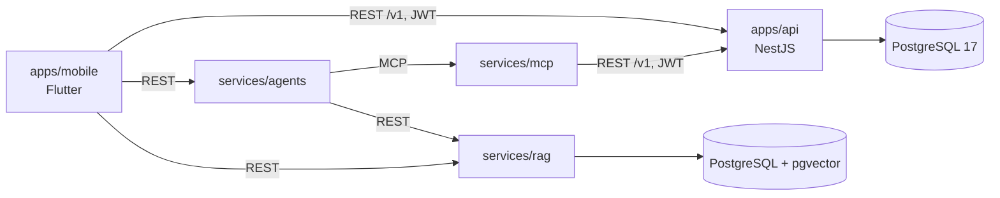
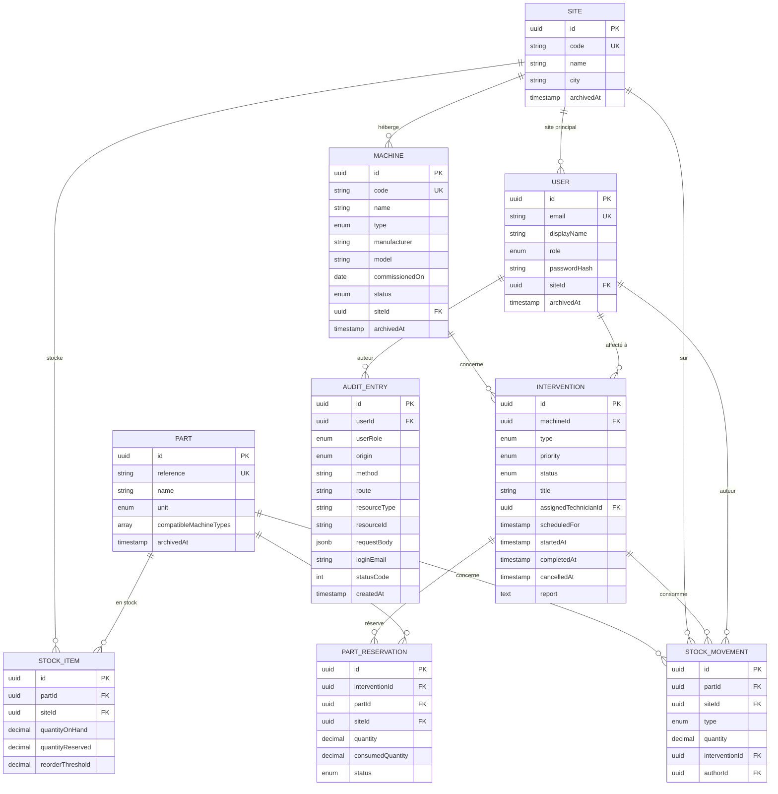

# Architecture technique

Vue d'ensemble technique de FieldOps : briques, données, contrats, sécurité, infrastructure. Ce document résume et relie ; les décisions sont justifiées dans les ADR (`docs/adr/`) et les comportements sont définis par les specs (`docs/specs/`), qui font foi en cas d'écart. Le pendant fonctionnel est [`cahier-des-charges-fonctionnel.md`](cahier-des-charges-fonctionnel.md).

## Décisions

| ADR | Décision | Statut |
| --- | --- | --- |
| [001](adr/001-choix-de-la-stack.md) | TypeScript et NestJS pour le serveur, Flutter pour le mobile, PostgreSQL 17, pnpm workspaces, Docker Compose | accepté |
| [002](adr/002-choix-orm.md) | TypeORM, `synchronize` désactivé, migrations versionnées | accepté |
| [003](adr/003-conventions-api.md) | Conventions de l'API : `/v1`, UUID, RFC 9457, pagination `limit`/`offset`, archivage | accepté |
| [004](adr/004-identification-et-droits.md) | JWT signé par l'API, argon2id, rôles `technician` et `manager` | accepté |

Les ADR de la méthode de travail (revue humaine, test-first) sont ceux du [template](https://github.com/yanis-vroland/agentic-dev-workflow/tree/main/docs/adr).

## Briques et flux

- Les briques ne partagent aucun code : uniquement des contrats (OpenAPI, MCP).
- Les appels aux modèles d'IA partent des briques serveur, jamais du mobile.
- État actuel : `apps/api` (socle, phase 0) ; les autres briques arrivent aux phases 2 à 4.

## apps/api

### Organisation du code

Un module NestJS par domaine, dans `apps/api/src/` :

| Module | Contenu | Spec |
| --- | --- | --- |
| `config` | lecture et validation des variables d'environnement | 001 |
| `health` | `GET /health` (terminus) | 001 |
| `common` | filtre d'erreurs RFC 9457, pagination, validation | 002 |
| `auth` | connexion, guards JWT et rôles | 003 |
| `users` | utilisateurs (lecture) | 003 |
| `audit` | enregistrement des écritures (intercepteur pour les succès, filtre d'exceptions global pour les refus, y compris les 401 et 403 levés par les guards), `GET /v1/audit-entries` | 004 |
| `sites`, `machines` | sites et machines | 005 |
| `parts`, `stock` | pièces, stock, mouvements | 006 |
| `interventions` | interventions et transitions | 007 |
| `reservations` | réservations de pièces | 008 |
| `seed` | jeu de données fictives | 009 |

Chaque module suit la même structure : `*.entity.ts` (TypeORM), `dto/` (class-validator), `*.service.ts` (règles métier, transactions), `*.controller.ts` (routes, droits, documentation OpenAPI). Les migrations sont dans `apps/api/src/migrations/`.

### Modèle de données (phase 1)

Toutes les tables ont `createdAt` et `updatedAt`. Contraintes en base, en plus des contrôles applicatifs :
- unicité de `site.code`, `machine.code`, `part.reference`, `user.email` (en minuscules), `(stock_item.partId, stock_item.siteId)`, et d'une réservation `active` par `(interventionId, partId)` (index unique partiel) ;
- `CHECK` : `quantityOnHand >= quantityReserved >= 0`.

### Cohérence et concurrence

- Les opérations qui touchent au stock (mouvements, réservations, clôture et annulation d'intervention) s'exécutent dans une transaction, avec verrouillage de la ligne de stock (`SELECT … FOR UPDATE`) : deux opérations simultanées ne peuvent pas dépasser le disponible (specs 006, 007, 008).
- Les transitions d'intervention verrouillent l'intervention et vérifient le statut dans la même transaction.
- L'entrée d'audit d'une écriture réussie est enregistrée dans la même transaction que l'écriture (spec 004, CA11) ; celle d'une écriture refusée, dans une transaction séparée (spec 004, CA12).
- Ordre des contrôles d'une requête : route, identification, rôle, validation, existence, droit sur la ressource, état (spec 002, CA13).
- Au démarrage : migrations, puis jeu de données si `SEED_ON_EMPTY=true` et base vide, puis ouverture du port (specs 002 et 009). Une seule instance de l'API : pas d'exécution concurrente.

### Conventions (ADR-003)

- Routes `/v1/<ressources-au-pluriel>`, corps en camelCase, énumérations en snake_case, dates ISO 8601 UTC.
- Erreurs RFC 9457 (`application/problem+json`), validation par DTO en liste blanche.
- Listes paginées `{ items, total, limit, offset }`, `limit` ≤ 100.
- Pas de suppression des données métier : archivage par `archivedAt`.

## Sécurité

| Sujet | Mesure | Référence |
| --- | --- | --- |
| Identification | JWT HS256, 8 h, `JWT_SECRET` toujours obligatoire (32 caractères minimum, pas de valeur par défaut dans le code) | ADR-004, spec 003 |
| Mots de passe | argon2id, jamais renvoyés ni journalisés | spec 003 |
| Droits | guards par rôle, vérification de l'affectation pour les actions du technicien | specs 003, 005 à 008 |
| Audit | toute écriture tracée, réussie ou refusée ; champs sensibles masqués à toute profondeur ; entrées non modifiables | spec 004 |
| Données de démonstration | chargement seulement avec `SEED_ON_EMPTY=true` ; remise à zéro seulement avec `ALLOW_SEED_RESET=true` | spec 009 |
| Entrées | validation en liste blanche, UUID contrôlés, corps JSON uniquement | spec 002 |
| Erreurs | aucune trace technique dans les réponses 500 | spec 002 |
| Secrets du dépôt | hook pre-commit gitleaks, analyse CI de tout l'historique, hook `protect-secrets` pour l'agent | template |
| Base de données | publiée sur `127.0.0.1` seulement en local | spec 001 |
| IA (phases 2 à 4) | humain dans la boucle, moindre privilège, PII masquée, tests d'injection de prompt | vision, specs à venir |

## Contrat OpenAPI

- Généré à partir du code (`pnpm --filter api openapi:generate`) dans `apps/api/openapi.json`, versionné, vérifié à jour par la CI (spec 001).
- Version SemVer dans `info.version` ; `1.0.0` à la fin de la phase 1 ; rupture détectée en CI par comparaison avec `main` (spec 009).
- Publication : artefact du workflow et release GitHub `api-v<version>` (spec 009). L'app mobile et le serveur MCP génèrent leurs clients à partir de ce fichier.

## Infrastructure et CI

| Élément | Rôle |
| --- | --- |
| `docker-compose.yml` | PostgreSQL 17 (healthcheck `pg_isready`) et l'API ; `docker compose up` lance toute la plateforme |
| `apps/api/Dockerfile` | image de l'API pour le local (non optimisée pour la production) |
| `.github/workflows/api.yml` | lint, format, tests unitaires et e2e (PostgreSQL 17 réel), contrat à jour, lancement par docker compose |
| `.github/workflows/garde-fous.yml` | tests des garde-fous du template, détection de secrets |
| `.github/workflows/ai-review.yml` | revue IA de chaque PR |

Tests : Vitest (unitaires, `src/**/*.spec.ts`) et Vitest + Supertest (e2e, `test/**/*.e2e-spec.ts`) sur un vrai PostgreSQL, jamais de mock de la base (ADR-002).

## Évolutions prévues

| Phase | Changement technique | Décision à prendre |
| --- | --- | --- |
| 2 | Point d'entrée serveur du copilote, accès aux modèles d'IA, client Flutter généré | ADR : emplacement du copilote, SDK et modèle, gestion de la clé |
| 3 | Image PostgreSQL avec pgvector, `services/rag`, Langfuse | spec du RAG ; usage de TypeORM pour les vecteurs (ADR-002) |
| 4 | `services/mcp`, `services/agents` (LangGraph.js) | ADR : identité des agents auprès de l'API (jeton relayé ou compte de service) |
| plus tard | Déploiement Kubernetes | migrations hors démarrage de l'API (ADR-003) |
