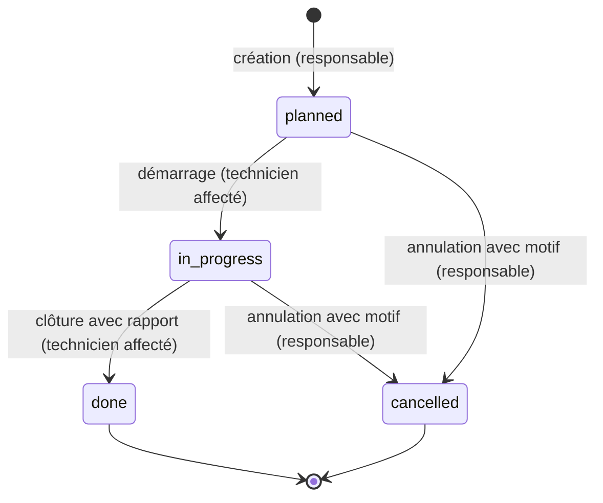
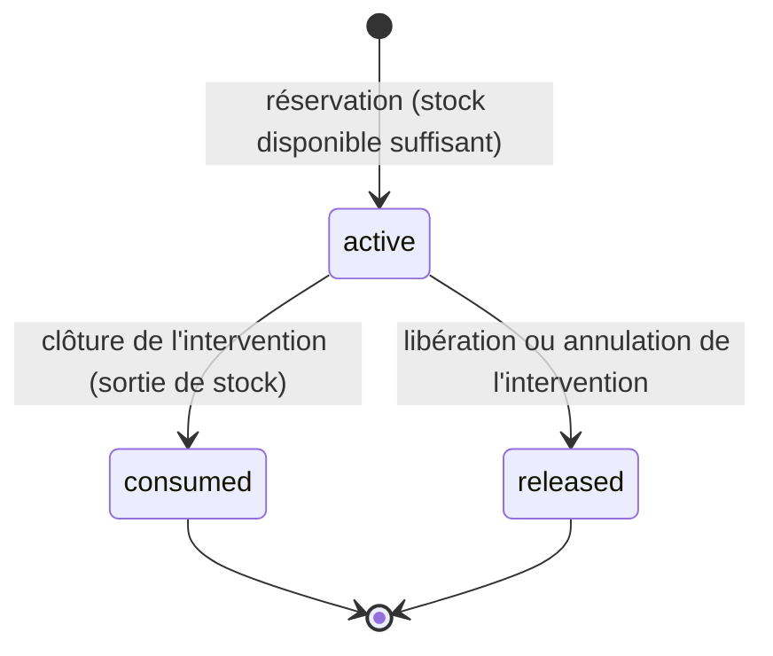

# Cahier des charges fonctionnel

Vue d'ensemble fonctionnelle de FieldOps : qui fait quoi, selon quelles règles. Ce document résume et relie ; le détail testable est dans les specs (`docs/specs/`), qui font foi en cas d'écart. Le contexte (pourquoi, périmètre, phases) est dans [`vision.md`](vision.md). Le pendant technique est [`architecture-technique.md`](architecture-technique.md).

Statut : phase 1 validée le 2026-10-09. Les règles métier de la phase 1 reprennent les réponses par défaut proposées par l'agent et acceptées en bloc par Yanis, ainsi que les défauts des questions ouvertes ci-dessous.

## Acteurs

| Acteur | Rôle dans l'API | Utilise | Phase |
| --- | --- | --- | --- |
| Technicien de maintenance | `technician` | app mobile (phase 2), API | 1 |
| Responsable maintenance | `manager` | API et Swagger (pas d'interface web d'administration) | 1 |
| Assistant IA (copilote, agents) | agit pour le compte d'un utilisateur, origine `ai_assistant` dans l'audit | API via le serveur, MCP | 2 à 4 |

Il n'y a ni inscription ni administration des comptes : les utilisateurs fictifs sont créés par le jeu de données (spec 009).

## Matrice des droits (phase 1)

| Action | Technicien | Responsable |
| --- | --- | --- |
| Se connecter, consulter son profil | oui | oui |
| Consulter sites, machines, pièces, stock, interventions, utilisateurs | oui | oui |
| Créer, modifier, archiver un site ou une machine | non | oui |
| Changer l'état d'une machine (en service, à l'arrêt, en panne) | oui | oui |
| Créer, modifier une pièce ; régler un seuil ; entrée ou ajustement de stock | non | oui |
| Sortie de stock (`issue`) | oui | oui |
| Créer, modifier, affecter, annuler une intervention | non | oui |
| Démarrer, clôturer une intervention | seulement s'il y est affecté | non |
| Compléter la description d'une intervention en cours | seulement s'il y est affecté | oui (et tous les autres champs) |
| Réserver, modifier, libérer des pièces pour une intervention | seulement s'il y est affecté | oui |
| Consulter le journal d'audit | non | oui |

Toute écriture, réussie ou refusée, est tracée dans le journal d'audit (spec 004). Cette matrice résume les specs 003 à 008, qui font foi et la testent.

## Glossaire

Le glossaire de référence est dans [`vision.md`](vision.md#domaine-métier). Compléments de la phase 1 :

| Terme | Dans le code | Définition |
| --- | --- | --- |
| Code de machine | `Machine.code` | Identifiant lisible et définitif d'une machine, partagé par toutes les briques (`PRS-003`) |
| Mouvement de stock | `StockMovement` | Entrée, sortie ou ajustement ; la quantité physique en est la somme |
| Quantité disponible | `StockItem.quantityAvailable` | Quantité physique moins quantité réservée |
| Entrée d'audit | `AuditEntry` | Trace d'une écriture : qui, quoi, quand, avec quelles données, quel résultat |
| Archivage | `archivedAt` | Retrait d'un élément des listes sans le supprimer, pour garder l'historique |

## Règles métier principales

### Machines

- Un code de machine suit le format `AAA-000`, est unique sur toute la plateforme et ne change ni ne se réattribue jamais.
- États : en service, à l'arrêt (prévu), en panne. Changer l'état ne crée pas d'intervention automatiquement.
- Une machine qui a une intervention prévue ou en cours ne peut pas être archivée.

### Stock

- Le stock se tient par pièce et par site. La quantité physique ne bouge que par des mouvements tracés.
- Une pièce est « sous le seuil » quand sa quantité disponible atteint le seuil d'alerte.
- Aucune opération ne rend le stock négatif, ni inférieur à ce qui est réservé.

### Cycle de vie d'une intervention

- Démarrer exige un technicien affecté ; clôturer exige un rapport.
- Une intervention terminée ou annulée est figée.

### Cycle de vie d'une réservation de pièce

- Réserver bloque la quantité sans la sortir du stock ; la clôture la sort ; l'annulation la libère.
- Stock insuffisant : réservation refusée. Pas de réservation partielle ni de commande fournisseur.
- À la clôture, le technicien peut déclarer une quantité réellement utilisée inférieure : le reste est libéré ; une quantité nulle libère toute la réservation.

## Parcours utilisateur

### Responsable : planifier une intervention corrective

1. Un technicien signale une panne : la machine passe « en panne ».
2. Le responsable crée une intervention corrective, priorité haute, sur la machine.
3. Il l'affecte à un technicien du site et réserve les pièces nécessaires.
4. Il suit l'avancement dans la liste des interventions, filtrée par statut ou par site.

### Technicien : réaliser une intervention

1. Il se connecte et consulte « mes interventions », triées par priorité puis par date.
2. Il vérifie que les pièces sont réservées ou disponibles sur son site.
3. Il démarre l'intervention sur place.
4. Il la clôture avec son rapport et les quantités de pièces réellement utilisées ; le stock est mis à jour.
5. Il remet la machine « en service ».

### Phase 2 et suivantes : avec l'assistant IA

Le copilote (phase 2) consulte, propose et n'agit qu'après confirmation de l'utilisateur ; ses écritures passent par les mêmes routes et les mêmes droits, et sont tracées avec l'origine `ai_assistant`. Détail à venir dans les specs de la phase 2.

## Fonctionnalités par phase

| Phase | Fonctionnalité | Spec | Statut |
| --- | --- | --- | --- |
| 0 | Socle : API vide, contrôle de santé, contrat, plateforme Docker | [001](specs/001-socle.md) | validée ; implémentation en PR #8 |
| 1 | Conventions communes (erreurs, validation, pagination) | [002](specs/002-conventions-api.md) | validée |
| 1 | Identification et droits | [003](specs/003-identification-et-droits.md) | validée |
| 1 | Journal d'audit | [004](specs/004-journal-audit.md) | validée |
| 1 | Sites et machines | [005](specs/005-sites-et-machines.md) | validée |
| 1 | Pièces et stock | [006](specs/006-pieces-et-stock.md) | validée |
| 1 | Interventions | [007](specs/007-interventions.md) | validée |
| 1 | Réservations de pièces | [008](specs/008-reservations-de-pieces.md) | validée |
| 1 | Données fictives et publication du contrat | [009](specs/009-donnees-fictives-et-contrat.md) | validée |
| 2 | App mobile du technicien et copilote | à rédiger | — |
| 3 | RAG sur la documentation des machines | à rédiger | — |
| 4 | Serveur MCP et agents | à rédiger | — |

## Questions tranchées à la validation de la phase 1

Les réponses par défaut ont été acceptées :

| Spec | Question | Défaut |
| --- | --- | --- |
| 003 | Le profil technicien a-t-il d'autres informations (téléphone, habilitations, spécialités) ? | non en phase 1 |
| 005 | Une machine en panne crée-t-elle une intervention corrective automatiquement ? | non, le responsable la crée ; le copilote pourra la proposer |
| 007 | Clôturer une intervention corrective remet-il la machine en service ? | non, changement d'état séparé |
| 009 | Outil de détection des ruptures de contrat ? | `oasdiff` en CI |
