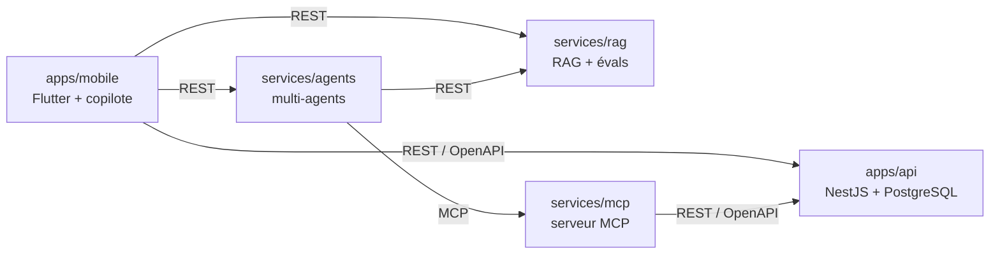

# Vision de FieldOps

Ce document décrit le projet dans son ensemble : ce qu'il est, comment ses briques s'assemblent, dans quel ordre elles sont construites et selon quelles règles. Il est la référence de contexte pour les humains comme pour l'agent de code.

## Ce qu'est FieldOps

FieldOps est une **plateforme fictive de maintenance industrielle**. Elle aide une équipe de maintenance à suivre ses machines, à organiser ses interventions et à gérer son stock de pièces, avec de l'IA intégrée au produit.

C'est un **projet portfolio** : il démontre la construction d'un produit IA complet, de l'API au mobile, en passant par le RAG, MCP et les agents, avec une méthode de développement agentique outillée par le template [agentic-dev-workflow](https://github.com/yanis-vroland/agentic-dev-workflow).

**Tout est fictif** : entreprises, sites, machines, documents et personnes. Aucune donnée réelle, aucun code ni nom issu d'un client ou d'un employeur.

## Utilisateurs

- **Technicien de maintenance** : sur le terrain, avec l'app mobile. Il consulte ses interventions, vérifie le stock, rédige ses rapports et pose des questions sur la documentation des machines.
- **Responsable maintenance** : il planifie, affecte les interventions et suit l'état du parc.

## Domaine métier

Vocabulaire indicatif. Les specs font foi, et ce glossaire évoluera avec elles. Le code est en anglais.

| Terme | Nom dans le code | Définition |
| --- | --- | --- |
| Site | `Site` | Usine ou atelier où se trouvent des machines |
| Machine | `Machine` | Équipement maintenu, rattaché à un site, identifié de façon unique |
| Intervention | `Intervention` | Opération de maintenance (préventive ou corrective) sur une machine, avec un statut et un technicien affecté |
| Pièce | `Part` | Référence de pièce détachée |
| Stock | `StockItem` | Quantité disponible d'une pièce, sur un site |
| Réservation | `PartReservation` | Pièce réservée pour une intervention |
| Technicien | `Technician` | Personne qui réalise les interventions |

L'identifiant de machine est partagé par toutes les briques : l'API, le RAG (pour filtrer la documentation par machine) et les agents.

## Architecture : un monorepo, des briques indépendantes

```
fieldops/
├── apps/
│   ├── api/          API cœur : NestJS + PostgreSQL
│   └── mobile/       App Flutter du technicien, avec copilote IA
├── services/
│   ├── rag/          Assistant sur la documentation technique, évalué et observé
│   ├── mcp/          Serveur MCP exposant l'API cœur
│   └── agents/       Système multi-agents qui organise une intervention
├── docs/
│   ├── vision.md     Ce document
│   ├── adr/          Décisions d'architecture (proposées par l'agent, validées par Yanis)
│   ├── specs/        Specs fonctionnelles
│   └── journal.md    Journal de bord
└── docker-compose.yml
```



Règles d'architecture :

- **Contrats explicites uniquement.** Les briques communiquent par une API REST documentée en OpenAPI ou par le protocole MCP. Aucun import de code d'une brique vers une autre.
- **Chaque brique est démontrable seule**, avec son README, sa démo, ses tests et ses commandes de lancement.
- **Une commande lance toute la plateforme** : `docker compose up`.
- **Les appels aux modèles d'IA partent toujours du serveur**, jamais de l'app mobile : les clés restent côté serveur, avec contrôle et audit.

## Stack

Décidée. L'ADR-001 en donne la justification.

- **Serveur** : TypeScript, NestJS, Node 24, pnpm workspaces
- **Base de données** : PostgreSQL 17, avec pgvector pour le RAG
- **Mobile** : Dart, Flutter (Android et iOS)
- **IA** : SDK et frameworks TypeScript (Vercel AI SDK ou API directe, LangChain.js, LangGraph.js, SDK MCP officiel), Langfuse pour l'observabilité
- **Infrastructure** : Docker Compose ; déploiement Kubernetes possible plus tard
- **ORM** : non choisi, ce sera l'ADR-002

## Ordre de construction

| Phase | Brique | Objectif | Fini quand |
| --- | --- | --- | --- |
| 0 | Socle | Monorepo, API vide avec Swagger, PostgreSQL, garde-fous du template | `docker compose up` et les tests passent sur un clone neuf |
| 1 | `apps/api` | Sites, machines, interventions, pièces, stock, réservations ; données fictives seedées | Les specs de la phase sont implémentées, le contrat OpenAPI est publié |
| 2 | `apps/mobile` | App du technicien et copilote : consulter, proposer, agir après confirmation | Une démo montre une demande en langage naturel aboutir à une intervention créée après confirmation |
| 3 | `services/rag` | Questions sur la documentation des machines, avec citations ; jeu d'évaluation, traces et quality gate en CI | Un tableau comparatif des configurations est dans le README, et la CI bloque une régression |
| 4 | `services/mcp` et `services/agents` | API exposée en MCP ; superviseur et agents (diagnostic, logistique, planification) | Une démo montre le scénario complet avec validation humaine, et les métriques d'évaluation sont publiées |

Scénario de référence de la phase 4 : « La presse n°3 fait un bruit anormal, organise l'intervention. »

## Principes transverses

- **Humain dans la boucle** : toute action d'écriture déclenchée par l'IA (créer une intervention, réserver une pièce) est confirmée par un humain avant exécution.
- **Audit** : chaque appel d'outil par l'IA est journalisé (qui, quoi, quand, avec quels arguments).
- **Moindre privilège** : chaque agent n'accède qu'aux outils dont il a besoin.
- **Mesure** : la qualité de l'IA se prouve par des évaluations chiffrées, pas par des démos.
- **Sécurité** : l'injection de prompt (directe et indirecte) est testée, et la PII est masquée avant envoi au modèle.

## Hors périmètre

- Données réelles, intégration à un ERP ou à un système existant
- Paiement, facturation
- Interface web d'administration (l'API et Swagger suffisent ; une interface pourra venir plus tard)
- Multi-entreprise : un seul client fictif

## Répartition des rôles

- **Yanis** décide : il valide les ADR, valide les specs, valide les tests avant implémentation, relit et merge chaque PR.
- **L'agent** propose et exécute : il rédige les ADR (statut « proposé ») et les specs, écrit les tests et le code, relit, et signale les choix structurants au lieu de les trancher.
